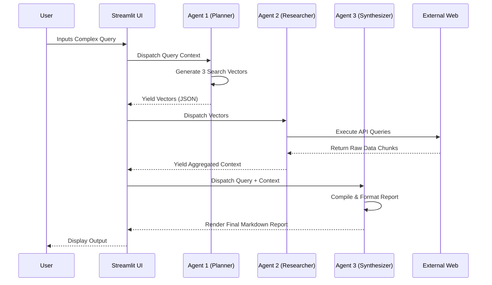

<div align="center">

# 🤖 Autonomous Multi-Agent Researcher
**Enterprise-Grade AI Orchestration & Automated Intelligence Synthesis**

[](#)
[](https://streamlit.io/)
[](https://ai.google.dev/)
[](#)
[](#)

*An asynchronous, multi-step agentic workflow designed to automate complex research. It leverages specialized LLM agents for strategic planning, live data scraping, and executive-level synthesis.*

</div>

## 📑 Table of Contents
- [Overview](#-overview)
- [Key Features](#-key-features)
- [System Architecture](#-system-architecture)
- [Tech Stack](#-tech-stack)
- [Local Development Setup](#-local-development-setup)
- [Environment Variables](#-environment-variables)
- [Deployment Strategy](#-deployment-strategy)
- [Roadmap](#-roadmap)

---

## 🎯 Overview
In modern business environments, manual data gathering and synthesis create severe operational bottlenecks. The **Autonomous Multi-Agent Researcher** solves this by treating research as an automated, programmatic pipeline. 

By passing conversational context between three distinct AI agents—a Planner, a Scraper, and a Synthesizer—this system dynamically generates highly targeted search vectors, interacts with live search indexes, and compiles comprehensive, fully-cited intelligence reports in real-time. It is built to seamlessly handle domain-agnostic queries, spanning geopolitical analysis, technical benchmarking, and financial forecasting.

---

## ✨ Key Features
* **Multi-Agent Orchestration:** Decouples tasks into specialized agents (Planner, Researcher, Synthesizer) to prevent context degradation and hallucination.
* **Dynamic Search Routing:** Automatically analyzes user intent to generate precise web-scraping vectors rather than relying on standard dictionary definitions.
* **Live Index Ingestion:** Bypasses static LLM knowledge cutoffs by actively pulling real-time data from web indexes.
* **Automated Data Synthesis:** Outputs cleanly formatted Markdown reports featuring Executive Summaries, Thematic Breakdowns, and precise inline citations mapped to source URLs.
* **Fault-Tolerant Execution:** Includes rate-limit safeguards and graceful degradation if external network requests fail.

---

## 🏗 System Architecture

The pipeline operates on a synchronous, sequential state machine architecture, moving data payloads from one specialized node to the next.



---

## 💻 Tech Stack

| Component | Technology | Purpose |
| --- | --- | --- |
| **Frontend UI** | `Streamlit` | Rapid prototyping of reactive data dashboards and state management. |
| **AI/LLM Engine** | `Google Gemini API` | Advanced reasoning, structured JSON generation, and language synthesis. |
| **Data Ingestion** | `duckduckgo-search` | Free, programmatic access to live web search results. |
| **Infrastructure** | `Python 3.10+` | Core orchestration logic and backend processing. |
| **Hosting** | `Hugging Face Spaces` | Cloud containerization for persistent, $0-cost deployment. |

---

## 🛠 Local Development Setup

To run this pipeline locally and test the orchestration logic:

1. **Clone the repository**
```bash
git clone [https://github.com/anberaziz5/autonomous-agent-researcher.git](https://github.com/anberaziz5/autonomous-agent-researcher.git)
cd autonomous-agent-researcher

```


2. **Create a virtual environment**
```bash
python -m venv venv
source venv/bin/activate  # On Windows use `venv\Scripts\activate`

```


3. **Install dependencies**
```bash
pip install -r requirements.txt

```


4. **Start the application**
```bash
streamlit run app.py

```


---

## 🔐 Environment Variables

Create a `.env` file in the root directory. The application requires the following secrets to function securely:

| Variable | Description | Where to get it |
| --- | --- | --- |
| `GEMINI_API_KEY` | Authenticates requests to the generative model. | [Google AI Studio](https://aistudio.google.com/) |

> **Warning:** Never commit your `.env` file to version control. It must be explicitly ignored in the `.gitignore`.

---

## 🚀 Deployment Strategy

This application is optimized for deployment as a containerized web app via **Hugging Face Spaces**, but can be deployed to any standard container orchestration platform (e.g., AWS ECS, Render, Railway).

**To deploy via Hugging Face Streamlit SDK:**

1. Create a new Space and select the **Streamlit** SDK.
2. Ensure the top of your `README.md` includes the proper YAML configuration (as seen in this repository).
3. Add `GEMINI_API_KEY` to your Space Secrets under *Settings > Variables and secrets*.
4. Upload `app.py` and `requirements.txt`. The platform will automatically provision the container and start the server.

*(Optional)* You can embed the live application into a custom domain or portfolio using a standard HTML iframe with the `?embed=true` parameter.

---

## 🗺 Roadmap

* [x] Basic orchestration of Planner, Researcher, and Synthesizer agents.
* [x] Integration of live web scraping via DuckDuckGo.
* [x] Graceful error handling for external network rate limits.
* [ ] Add PDF document ingestion for internal RAG (Retrieval-Augmented Generation) capabilities.
* [ ] Implement parallel processing for the Researcher agent to decrease execution time.
* [ ] Support for downloading the final report directly as a `.pdf` or `.docx` file.

---

*Built by a Systems Architect passionate about bridging operational gaps with AI.*